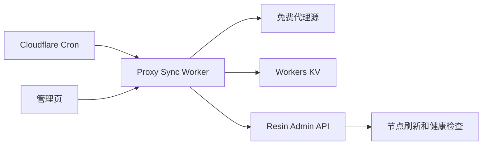

# Resin Free Proxy Sync

一个独立的 Cloudflare Worker：每天按设定时间拉取免费代理，过滤、去重后更新 Resin 中的固定本地订阅，并触发刷新。

它不需要额外服务器，也不要求在你的电脑安装 Node.js 或项目依赖。通过 **Deploy to Cloudflare** 部署时，Cloudflare 会在自己的构建环境中安装依赖、创建 KV、配置 Cron 并发布 Worker。


## 一键部署

[](https://deploy.workers.cloudflare.com/?url=https://github.com/strongshuai/resin-free-proxy-sync)

完整步骤见 [Cloudflare 纯网页部署说明](./CLOUDFLARE_DEPLOY.md)。

部署页面会要求填写四项 Secret：

| 名称 | 填写内容 |
| --- | --- |
| `RESIN_API_BASE` | Resin 公网根地址，例如 `http://服务器IP:2260` |
| `RESIN_ADMIN_TOKEN` | Resin 的 Admin Token |
| `ADMIN_TOKEN` | 登录本项目管理页的长密码 |
| `FEED_TOKEN` | 可选订阅地址的长密码 |

Resin 地址和 Token 不能从 GitHub 或 Cloudflare 自动读取你电脑的 `O:` 盘，因此只需在部署页面手动粘贴一次。不要把真实 Token 写入 GitHub 文件。

## 架构



## 功能

- 管理页选择代理来源以及 `HTTP`、`HTTPS`、`SOCKS5` 协议。
- 设置 IANA 时区和每天执行时间，默认时区为 `Asia/Shanghai`。
- 对响应体积、IP、端口、协议和每来源数量做限制。
- 按来源隔离抓取错误，合并成功结果并去重。
- 内置多个独立来源；长期维护候选包括 TheSpeedX、Hookzof、Roosterkid、Monosans、Sunny9577 和 Zaeem20。
- 首次创建 Resin 固定本地订阅，后续只更新同一订阅。
- KV 保存设置、快照、订阅 ID 和最近 20 次运行历史。
- 提供 Token 保护的可选订阅地址 `/feed/<FEED_TOKEN>`。

## 部署后的设置

1. 打开 Cloudflare 给出的 `workers.dev` 地址。
2. 输入部署时填写的 `ADMIN_TOKEN`。
3. 选择来源、协议、每日时间和时区。
4. 打开“启用每日任务”并保存。
5. 点击一次“立即同步”，确认 Resin 中出现或更新订阅。

Cron 每 5 分钟唤醒一次，Worker 只会在配置时间到达后每天执行一次，因此修改每日时间不需要重新部署。

## HTTP Resin 地址

Cloudflare Workers 的 `fetch()` 支持 HTTP 和自定义端口，但直接请求裸 IPv4 地址会返回 Cloudflare `1003`。本项目会自动把：

```text
http://203.0.113.10:2260
```

转换为等价的：

```text
http://203-0-113-10.sslip.io:2260
```

`sslip.io` 只负责把主机名解析回原 IP，不需要配置域名、修改 Resin 或安装 HTTPS 证书。

HTTP 不会被强制升级为 HTTPS，但 Resin Admin Token 会通过公网明文传输。

## Resin 更新行为

首次成功运行：

1. `POST /api/v1/subscriptions` 创建 `source_type=local` 的订阅。
2. 保存订阅 ID。
3. 调用 refresh action。

后续运行会根据订阅 ID 或名称找到同一订阅，使用 `PATCH` 替换代理内容，再触发 refresh，不会每天创建新订阅。

## 开发验证

下面的命令仅供修改源码的开发者使用，使用 Cloudflare 一键部署的人不需要执行：

```bash
pnpm install
pnpm run check
pnpm run deploy
```

## 官方资料

- [Deploy to Cloudflare buttons](https://developers.cloudflare.com/workers/platform/deploy-buttons/)
- [Cloudflare Cron Triggers](https://developers.cloudflare.com/workers/configuration/cron-triggers/)
- [Workers KV](https://developers.cloudflare.com/kv/)
- [Workers custom port compatibility](https://developers.cloudflare.com/workers/configuration/compatibility-flags/#allow-specifying-a-custom-port-when-making-a-subrequest-with-the-fetch-api)
- [Resinat/Resin](https://github.com/Resinat/Resin)
